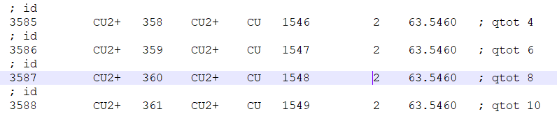

🔬💻 GROMACS Simulation: Running 10 ns Molecular Dynamics for Metalloprotein with 4 Copper Ions (No Ligands)

🔧 **Step 1:** Save only Cu ions in a PDB file and generate position restraints.

- Run `gmx editconf -f cu.pdb -o cu.gro`.
- Run `gmx genrestr -f cu.gro -o posre-cu.itp`.

🔧 **Step 2:** Open your protein PDB without any ions and delete hydrogens.

🔧 **Step 3:** Process the protein PDB file to generate a GROMACS coordinate file with the SPC water model.

 - Run `gmx pdb2gmx -f protein.pdb -o protein.gro -water spc`.

🔧 **Step 4:** Add copper ions coordinates to the topology file.

*It's an example. Make sure to change the ID based on your work.*
 
🔧 **Step 5:**  Merge the GRO file of copper ions with the GRO file of the protein, and adjust the atom numbers.

🔧 **Step 6:** Utilize GROMACS to adjust the dimensions of the simulation box for the protein structure in the "protein.gro" file, setting it to 7x6x9 and 
    centering the protein within the box at coordinates (3.5, 3, 3.2). Save the resulting structure to "box.gro".
  - Run `gmx editconf -f protein.gro -o box.gro -box 7 6 9 -center 3.5 3 3.2`.

🔧 **Step 7:**  Solvate the system by adding water molecules around the solute.
  - Run `gmx solvate -cp box.gro -cs spc216.gro -o solvate.gro -p topol.top`.
    
🔧  **Step 8:** Generate position restraints for the ions in the solvated system to keep them fixed during the simulation while allowing other atoms to move 
  freely.
   - Run `gmx genrestr -f solvate.gro -o posres-strong.itp -fc 100000 100000 100000`.
* Select: Group    12 (            Ion) has     4 elements.*

 🔧  **Step 9:** Prepare the system for energy minimization by generating the simulation input file ("ions.tpr") using gmx grompp, integrating "minim.mdp", 
 "solvate.gro", and "topol.top," allowing a maximum of 10 warnings with -maxwarn 10.
   - Run `gmx grompp -f minim.mdp -c solvate.gro -p topol.top -o ions.tpr -maxwarn 10`.

 🔧  **Step 10:** Add counterions to neutralize the system charge.
   - Run `gmx genion -s ions.tpr -o ions.gro -p topol.top -nname CL -nn 10`.

  🔧  **Step 11:** Prepare system for energy minimization.
   - Run `gmx grompp -f minim.mdp -c ions.gro -p topol.top -o em.tpr -maxwarn 10`.

  🔧  **Step 12:**  Run energy minimization.
   - Run `gmx mdrun -v -deffnm em -nt 8 -s em.tpr`.

  🔧  **Step 13:**  Calculate potential energy.
   - Run `gmx energy -f em.edr -o potential.xvg`.

   🔧  **Step 14:** Prepare system for NVT ensemble simulation.
   - Run `gmx grompp -f nvt.mdp -c em.gro -p topol.top -o nvt.tpr -maxwarn 10`.

   🔧  **Step 15:** Run NVT ensemble simulation.
   - Run `gmx mdrun -deffnm nvt -v -nt 32`.

   🔧  **Step 16:** Calculate the temperature during the NVT ensemble simulation.
   - Run `gmx energy -f nvt.edr -o temp.xvg`.

   🔧  **Step 17:** Prepare the system for NPT ensemble simulation.
   - Run `gmx grompp -f npt.mdp -c nvt.gro -p topol.top -o npt.tpr -maxwarn 10`.

   🔧  **Step 18:**  Run NPT ensemble simulation.
   - Run `gmx mdrun -v -deffnm npt -nt 32`.

   🔧  **Step 19:**  Calculate the pressure during the NPT ensemble simulation.
   - Run `gmx energy -f npt.edr -o pressure.xvg`.

    
   
 
 

     
     

  
  
  

